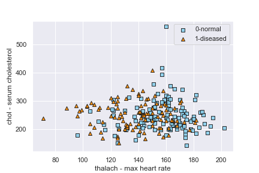
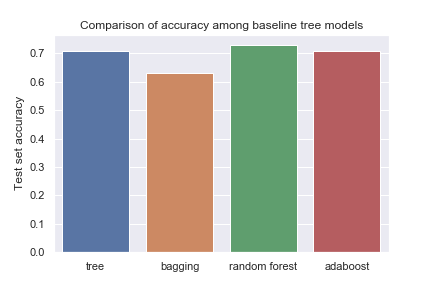

## Decision Trees

In this example, we will explore the use of machine learning to predict an individual's risk of heart disease from demographic information as well as diagnostic test data. More specifically, We will look at various decision tree ensemble models. This exercise has two objectives:

1. Learn about decision trees and understand when to apply them
2. Learn how to deploy machine learning models in production

## Data
The data is from the UCI Machine Learning Repository. A csv file is available in the /raw-data directory and can also be downloaded from the source: https://archive.ics.uci.edu/ml/datasets/Heart+Disease . While there are multiple datasets available, we will use the one processed by the Cleveland Clinic Foundation. More information about the dataset is available in info.txt in the raw-data directory.

The dataset has 14 predictors of heart disease.  For the sake of simplicity, we will use only two of them as predictors - maximum heart rate achieved (thalach) and serum cholesterol levels (chol). A scatter plot of the training dataset is shown below (Fig 1).

## Analysis
We will do the analysis in three parts in three different notebooks. Part 1 explains how the data should be preprocessed. Part 2 deals with model building. Part 3 explains how to deploy the models in a production (work in progress).

We will train 4 different decision tree-based models and choose the best one.

## Dependencies:
Python 3.6  
Packages:
- Modeling: pandas, numpy, sci-kit learn
- Plotting: matplotlib, mlxtend
- Deployment: flask, dill
